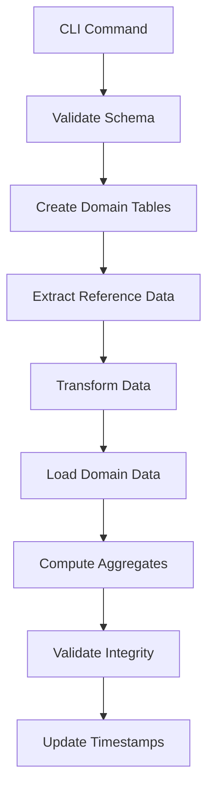

# Design Document: Domain-API Consolidation

## Overview

This design consolidates the domain models and API models by extending domain models to contain all data needed by the API, eliminating the API's dependency on reference databases. The system will use a unified domain database with migrations to populate domain tables from reference data.

## Current State Analysis

### Current Architecture
- **Domain Models** (`src/mtgsim/db/`): SQLModel classes with basic card/set/deck entities
- **API Models** (`src/mtgsim/api/models/`): Pydantic response models with rich data structures
- **Data Access** (`src/mtgsim/api/data/`): Direct SQL queries against multiple reference databases
- **Reference Database**: `~/.mtgsim/reference/mtgjson/mtgjson-merged.sqlite` (primary source compiled from individual MTGJSON datasets)

### Current Data Flow
```
API Router → Service → Data Layer → Reference Database (mtgjson-merged.sqlite)
                                 ↓
                            Transform & Aggregate
                                 ↓
                            API Response Models
```

### Key Issues
1. API tightly coupled to reference database structure
2. Data transformation scattered across data access layer
3. Domain models incomplete - missing fields needed by API

## Target Architecture

### New Data Flow
```
API Router → Service → Domain Database → Reference Tables (mtgjson_*) → Domain Models
                                      ↓
                               Transform to API Models
```

### User Card Selection Flow  
```
User Selection → Domain Service → Reference Tables → Transform → Domain Tables (card, set, deck)
```

### Migration Flow
```
Reference Database → Migration System → Domain Database (Reference Tables)
(mtgjson-merged.sqlite)  (CLI Commands)      (mtgjson_card, mtgjson_set, ...)
                                                      ↓
User Selection → Domain Service → Transform → Domain Tables (card, set, deck)
```

## Domain Model Extensions

### Enhanced Card Model

```python
class CardDB(SQLModel, table=True):
    # Existing fields...
    id: int | None = Field(default=None, primary_key=True)
    name: str = Field(index=True)
    uuid: str | None = Field(default=None, unique=True, index=True)
    
    # Extended fields for API compatibility
    mana_cost: str | None = None  # Original mana cost string
    type_line: str | None = None  # Full type line
    oracle_text: str = ""
    flavor_text: str = ""
    
    # Pricing data (embedded from reference)
    tcgplayer_price_usd: float | None = None
    tcgplayer_price_usd_foil: float | None = None
    cardmarket_price_eur: float | None = None
    mtgo_price_tix: float | None = None
    
    # Set relationship data
    set_code: str | None = Field(default=None, index=True)
    set_name: str | None = None
    collector_number: str | None = None
    rarity: str = "common"
    
    # Legality data (JSON field)
    legalities: dict = Field(default_factory=dict, sa_column=Column(JSON))
    
    # Identifiers for external services
    scryfall_id: str | None = Field(default=None, unique=True, index=True)
    mtgo_id: int | None = None
    arena_id: int | None = None
    tcgplayer_id: int | None = None
    cardmarket_id: int | None = None
    
    # Relationships
    colors: list["CardColorLink"] = Relationship(cascade_delete=True)
    card_types: list["CardTypeLink"] = Relationship(cascade_delete=True)
    supertypes: list["CardSupertypeLink"] = Relationship(cascade_delete=True)
    subtypes: list["CardSubtypeLink"] = Relationship(cascade_delete=True)
    
    # Computed properties for API compatibility
    @property
    def color_identity(self) -> list[str]:
        return [link.color for link in self.colors]
    
    @property
    def type_list(self) -> list[str]:
        return [link.card_type for link in self.card_types]
```

### Enhanced Set Model

```python
class SetDB(SQLModel, table=True):
    # Existing fields...
    code: str = Field(primary_key=True)
    name: str = Field(index=True)
    type: str = Field(index=True)
    
    # Extended fields for API compatibility
    release_date: str | None = Field(default=None, index=True)
    base_set_size: int = 0
    total_set_size: int = 0
    block: str | None = Field(default=None, index=True)
    keyrune_code: str | None = None
    
    # Aggregated statistics (computed during migration)
    total_price_usd: float | None = None
    average_price_usd: float | None = None
    card_count_by_rarity: dict = Field(default_factory=dict, sa_column=Column(JSON))
    color_distribution: dict = Field(default_factory=dict, sa_column=Column(JSON))
    
    # Relationships
    cards: list["CardDB"] = Relationship(back_populates="set_ref")
```

### Enhanced Deck Model

```python
class DeckDB(SQLModel, table=True):
    # Existing fields...
    uuid: str = Field(primary_key=True)
    file_name: str = Field(index=True, unique=True)
    code: str
    name: str
    
    # Extended fields for API compatibility
    type: str | None = None
    release_date: str | None = None
    
    # Aggregated data (computed during migration)
    total_price_usd: float | None = None
    main_board_count: int = 0
    side_board_count: int = 0
    commander_count: int = 0
    
    # Color identity (computed from cards)
    color_identity: list[str] = Field(default_factory=list, sa_column=Column(JSON))
    
    # Format legalities (computed from cards)
    format_legalities: dict = Field(default_factory=dict, sa_column=Column(JSON))
    
    # Mana curve data
    mana_curve: dict = Field(default_factory=dict, sa_column=Column(JSON))
    
    # Relationships
    cards: list["DeckCardDB"] = Relationship(back_populates="deck")
```

## Migration System Design

### CLI Command Structure

```python
# src/mtgsim/cli/migrate.py
@app.command()
def sync_reference():
    """Sync reference database tables to domain database."""
    
@app.command()
def sync_mtgjson():
    """Sync MTGJSON tables from mtgjson-merged.sqlite to domain database."""
    
@app.command()
def add_card(uuid: str):
    """Add a specific card to user's domain tables."""
    
@app.command()
def add_set(code: str):
    """Add all cards from a set to user's domain tables."""
    
@app.command()
def add_deck(uuid: str):
    """Add a deck and its cards to user's domain tables."""
```

### Migration Process Flow



### Data Transformation Logic

#### Reference Table Sync
```python
def sync_mtgjson_tables():
    """Copy complete MTGJSON tables to domain database with prefix."""
    
    # Copy entire tables with prefix
    copy_table_with_prefix(
        source_db="mtgjson-merged.sqlite",
        target_db="domain/mtgsim.sqlite", 
        table_name="card",
        prefix="mtgjson_"
    )
    
    copy_table_with_prefix(
        source_db="mtgjson-merged.sqlite",
        target_db="domain/mtgsim.sqlite",
        table_name="set", 
        prefix="mtgjson_"
    )
```

#### Domain Entity Addition
```python
def add_card_to_domain(card_uuid: str):
    """Transform reference card data into enhanced domain model."""
    
    # Query reference table
    ref_card = session.exec(
        select(MTGJsonCard).where(MTGJsonCard.uuid == card_uuid)
    ).first()
    
    if not ref_card:
        raise CardNotFoundError(f"Card {card_uuid} not found in reference data")
    
    # Transform to domain model with enhancements
    domain_card = Card(
        uuid=ref_card.uuid,
        name=ref_card.name,
        mana_cost=ref_card.mana_cost,
        type_line=ref_card.type,
        oracle_text=ref_card.text,
        
        # Enhanced fields computed during transformation
        legalities=parse_json_dict(ref_card.legalities),
        tcgplayer_price_usd=get_current_price(ref_card.uuid),
        color_identity=parse_json_list(ref_card.color_identity),
        
        # Metadata
        added_at=datetime.utcnow(),
        source="mtgjson"
    )
    
    # Handle relationships
    for color in domain_card.color_identity:
        domain_card.colors.append(CardColorLink(color=color))
        
    session.add(domain_card)
    session.commit()
```

#### API Data Access Pattern
```python
def search_cards(self, **filters) -> tuple[list[Card], int]:
    """Search user's domain cards, fallback to reference tables."""
    
    # First check user's domain tables
    domain_query = select(Card)
    
    # Apply filters to domain tables
    if filters.get("q"):
        domain_query = domain_query.where(Card.name.contains(filters["q"]))
    
    domain_cards = session.exec(domain_query).all()
    
    # If user wants to see all available cards, query reference tables
    if filters.get("include_all_cards", False):
        ref_query = select(MTGJsonCard)
        
        # Apply same filters to reference tables
        if filters.get("q"):
            ref_query = ref_query.where(MTGJsonCard.name.contains(filters["q"]))
            
        ref_cards = session.exec(ref_query).all()
        
        # Transform reference cards to domain model format (read-only)
        all_cards = domain_cards + [
            transform_ref_to_domain_readonly(card) for card in ref_cards
            if card.uuid not in {dc.uuid for dc in domain_cards}
        ]
        
        return all_cards, len(all_cards)
    
    return domain_cards, len(domain_cards)
```

## Data Access Layer Refactoring

### New Data Access Pattern

```python
# src/mtgsim/api/data/cards.py (refactored)
class CardsData:
    def search_cards(self, **filters) -> tuple[list[Card], int]:
        """Search cards using domain database tables."""
        
        # Determine search scope
        if filters.get("scope") == "user":
            # Search only user's domain tables
            query = select(Card)
        elif filters.get("scope") == "reference":
            # Search reference tables (read-only)
            query = select(MTGJsonCard)
        else:
            # Default: search user's cards, with option to include reference
            query = select(Card)
        
        # Apply filters using SQLModel
        if filters.get("q"):
            if filters.get("scope") == "reference":
                query = query.where(MTGJsonCard.name.contains(filters["q"]))
            else:
                query = query.where(Card.name.contains(filters["q"]))
        
        if filters.get("set_code"):
            if filters.get("scope") == "reference":
                query = query.where(MTGJsonCard.set_code == filters["set_code"])
            else:
                query = query.where(Card.set_code == filters["set_code"])
        
        # Execute with pagination
        total = session.exec(select(func.count()).select_from(query.subquery())).one()
        
        offset = (filters["page"] - 1) * filters["limit"]
        results = session.exec(
            query.offset(offset).limit(filters["limit"])
        ).all()
        
        return results, total
```

### Service Layer Adaptation

```python
# src/mtgsim/api/services/card_service.py (refactored)
class CardService:
    async def search_cards(self, **filters) -> CardListResponse:
        """Search cards and convert to API models."""
        results, total = cards_data.search_cards(**filters)
        
        # Convert to API models (works for both domain and reference cards)
        api_cards = []
        for card in results:
            # Handle both domain Card and reference MTGJsonCard
            if isinstance(card, Card):
                # Domain card with full enhancements
                api_card = CardSummary(
                    uuid=card.uuid,
                    name=card.name,
                    type=card.type_line,
                    mana_cost=card.mana_cost,
                    mana_value=card.mana_value,
                    rarity=card.rarity,
                    set_code=card.set_code,
                    color_identity=card.color_identity,
                    text=card.oracle_text,
                    price=card.tcgplayer_price_usd,
                    image_url=self._build_image_url(card.scryfall_id),
                    in_collection=True  # User's card
                )
            else:
                # Reference card (read-only)
                api_card = CardSummary(
                    uuid=card.uuid,
                    name=card.name,
                    type=card.type,
                    mana_cost=card.mana_cost,
                    mana_value=card.mana_value,
                    rarity=card.rarity,
                    set_code=card.set_code,
                    color_identity=parse_json_list(card.color_identity),
                    text=card.text,
                    price=None,  # No pricing for reference cards
                    image_url=self._build_image_url(card.scryfall_id),
                    in_collection=False  # Not user's card
                )
            
            api_cards.append(api_card)
        
        return CardListResponse(
            data=api_cards,
            pagination=Pagination(
                page=filters["page"],
                limit=filters["limit"],
                total=total,
                pages=(total + filters["limit"] - 1) // filters["limit"]
            )
        )
    
    async def add_card_to_collection(self, card_uuid: str) -> Card:
        """Add a card from reference tables to user's domain tables."""
        return add_card_to_domain(card_uuid)
```

## Database Schema Changes

### Domain Database Structure

The domain database will contain two types of tables:

1. **Reference Table Copies**: Complete copies of reference database tables, prefixed with source name
2. **Domain Tables**: Unprefixed tables containing user-selected/relevant entities with enhanced domain model fields

```sql
-- Single unified database: ~/.mtgsim/domain/mtgsim.sqlite

-- Reference table copies (complete data from sources)
CREATE TABLE mtgjson_card (...);     -- Complete copy from mtgjson-merged.sqlite
CREATE TABLE mtgjson_set (...);      -- Complete copy from mtgjson-merged.sqlite  
CREATE TABLE mtgjson_deck (...);     -- Complete copy from mtgjson-merged.sqlite
-- Future: tcgplayer_price, scryfall_card, etc.

-- Domain tables (user-relevant entities with enhanced models)
CREATE TABLE card (               -- Enhanced CardDB model
    id INTEGER PRIMARY KEY,
    uuid TEXT UNIQUE,
    name TEXT,
    -- All fields from enhanced CardDB model
    -- Populated selectively from reference tables
);

CREATE TABLE set (                -- Enhanced SetDB model  
    code TEXT PRIMARY KEY,
    name TEXT,
    -- All fields from enhanced SetDB model
    -- Populated selectively from reference tables
);

CREATE TABLE deck (               -- Enhanced DeckDB model
    uuid TEXT PRIMARY KEY, 
    name TEXT,
    -- All fields from enhanced DeckDB model
    -- Populated selectively from reference tables
);

-- Migration tracking
CREATE TABLE migration_log (
    id INTEGER PRIMARY KEY,
    migration_type TEXT NOT NULL,
    source_name TEXT NOT NULL,     -- e.g., 'mtgjson', 'tcgplayer'
    started_at TIMESTAMP,
    completed_at TIMESTAMP,
    status TEXT,
    error_message TEXT
);
```

### Configuration Changes

```python
# src/mtgsim/config.py
DOMAIN_DB_PATH = Path.home() / ".mtgsim" / "domain" / "mtgsim.sqlite"
REFERENCE_DB_PATH = Path.home() / ".mtgsim" / "reference" / "mtgjson" / "mtgjson-merged.sqlite"
```

## Implementation Plan

### Phase 1: Domain Database Schema Setup
1. Create domain database with reference table structure (mtgjson_*)
2. Create enhanced domain tables (card, set, deck) with SQLModel definitions
3. Implement migration tracking table and logging

### Phase 2: Reference Table Sync System
1. Implement CLI commands for syncing reference tables to domain database
2. Build table copying utilities with prefix support
3. Add validation and integrity checking for reference data

### Phase 3: Domain Entity Management
1. Implement CLI commands for adding cards/sets/decks to domain tables
2. Build transformation logic from reference to enhanced domain models
3. Add user collection management capabilities

### Phase 4: Data Access Layer Refactoring
1. Update data access layer to query domain database tables
2. Implement scope-based querying (user vs reference vs combined)
3. Add conversion utilities between reference and domain models

### Phase 5: API Layer Updates
1. Update service layer to handle both domain and reference card types
2. Add collection management endpoints (add/remove cards)
3. Ensure API response compatibility with existing format

### Phase 6: Testing & Validation
1. Ensure API responses remain identical for existing functionality
2. Test new collection management features
3. Performance testing with domain database structure
4. Migration testing with sample MTGJSON data

## Performance Considerations

### Indexing Strategy
- Primary keys: `id`, `uuid`, `code`
- Search indexes: `name`, `set_code`, `rarity`
- Filter indexes: `color_identity`, `type_line`
- Relationship foreign keys

### Query Optimization
- Use SQLModel relationships for joins
- Batch operations for bulk data
- Pagination for large result sets
- Computed aggregates to avoid runtime calculations

### Migration Performance
- Batch inserts for large datasets
- Progress reporting for long operations
- Incremental updates to avoid full rebuilds
- Parallel processing for independent entities

## Correctness Properties

*A property is a characteristic or behavior that should hold true across all valid executions of a system—essentially, a formal statement about what the system should do. Properties serve as the bridge between human-readable specifications and machine-verifiable correctness guarantees.*

### Property 1: Domain Model Completeness
*For any* API response field in the current system, there should exist a corresponding field or computed property in the domain model that provides the same data
**Validates: Requirements 1.1**

### Property 2: Reference Table Sync Integrity
*For any* table in the reference database, after sync there should exist a complete copy in the domain database with the appropriate prefix
**Validates: Requirements 2.1, 2.2**

### Property 3: Domain Entity Addition Correctness
*For any* card added to the domain tables, it should contain all enhanced fields properly transformed from the reference data
**Validates: Requirements 1.1, 2.2**

### Property 4: Sync Operation Idempotence
*For any* reference table sync operation, running it multiple times should produce the same final state as running it once
**Validates: Requirements 2.3**

### Property 5: API Response Compatibility
*For any* API endpoint and query parameters, the response structure after consolidation should be identical to the response structure before consolidation
**Validates: Requirements 3.1, 3.2**

### Property 6: Domain to API Model Conversion
*For any* domain model instance, it should be possible to construct a valid API model response that contains all required fields
**Validates: Requirements 3.4, 4.3**

### Property 7: Reference Table Query Compatibility
*For any* query that previously worked against reference databases, the same query should work against the domain database reference tables
**Validates: Requirements 3.2, 4.1**

### Property 8: Relationship Navigation
*For any* related entities in the domain model, navigating the relationship in both directions should maintain referential integrity
**Validates: Requirements 1.3, 4.4**

### Property 9: Selective Entity Addition
*For any* card addition operation, only the specified card should be added to the domain tables without affecting other entities
**Validates: Requirements 5.2**

### Property 10: Collection Management Consistency
*For any* card in the user's domain tables, it should be possible to query both the enhanced domain version and the original reference version
**Validates: Requirements 4.1, 4.3**

### Property 11: Migration Rollback Consistency
*For any* failed sync operation, rolling back should restore the domain database to its exact state before the sync attempt
**Validates: Requirements 5.4**

### Property 12: Schema Validation Correctness
*For any* domain database schema, validation should correctly identify incompatibilities before allowing sync operations
**Validates: Requirements 5.3**

### Property 13: Layer Boundary Enforcement
*For any* domain model class, it should not contain dependencies on API-specific libraries or formatting logic
**Validates: Requirements 6.3, 6.5**

## Error Handling & Rollback

### Migration Safety
- Transaction-based migrations
- Backup creation before migration
- Validation checkpoints
- Automatic rollback on failure

### Runtime Error Handling
- Graceful degradation when domain DB unavailable
- Clear error messages for missing data
- Fallback to reference database during transition (optional)

## Backward Compatibility

### API Response Compatibility
- Identical JSON structure
- Same field names and types
- Preserved pagination metadata
- Maintained error response format

### CLI Compatibility
- Existing commands continue working
- New migration commands added
- Configuration backward compatible
- Database paths configurable

## Testing Strategy

### Dual Testing Approach
The system will use both unit tests and property-based tests to ensure comprehensive coverage:

- **Unit tests**: Verify specific examples, edge cases, and error conditions
- **Property tests**: Verify universal properties across all inputs using generated test data
- Both approaches are complementary and necessary for comprehensive validation

### Property-Based Testing Configuration
- **Framework**: Use Hypothesis for Python property-based testing
- **Test iterations**: Minimum 100 iterations per property test to ensure thorough coverage
- **Test tagging**: Each property test must reference its design document property using the format:
  - **Feature: domain-api-consolidation, Property {number}: {property_text}**

### Unit Testing Focus Areas
- Migration command execution and error handling
- API endpoint compatibility with existing integrations  
- Domain model relationship navigation
- Data transformation accuracy during migration
- CLI command validation and rollback scenarios

### Integration Testing
- End-to-end migration workflows from reference to domain database
- API response validation against current system behavior
- Performance regression testing for common query patterns
- Cross-layer boundary enforcement (domain, data access, API)

### Test Data Management
- Use sample MTGJSON data subsets for predictable test scenarios
- Generate synthetic domain model instances for property testing
- Maintain test database fixtures for migration testing
- Isolate tests to prevent interference between test runs

This design provides a clear path to consolidate domain and API models while maintaining system reliability and performance.