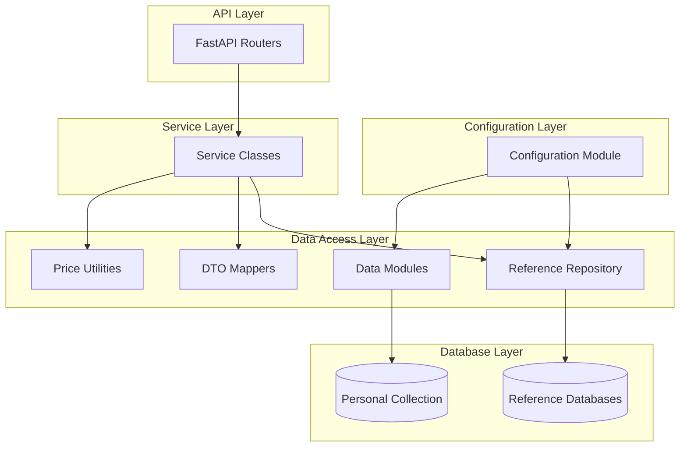

# Design Document

## Overview

This design document outlines the refactoring of the MTGSim codebase to eliminate code duplication, centralize configuration management, unify database access patterns, and improve maintainability. The refactor will preserve all existing functionality while creating a more maintainable and extensible architecture.

The refactor addresses several key pain points:
- Repeated SQL fragments and price lookups across data modules
- Manual dict-to-Pydantic mapping duplication in services
- Inconsistent path resolution across modules
- Mixed database access patterns between personal collection and reference data
- Brittle CLI command registration
- Stubbed statistics endpoints

## Architecture

The refactored architecture introduces several new layers and components while maintaining the existing FastAPI router → service → data layer pattern:



## Components and Interfaces

### Configuration Module

**Location**: `src/mtgsim/config.py`

The configuration module provides centralized path management and application settings:

```python
class MTGSimConfig:
    """Centralized configuration for MTGSim application."""
    
    @property
    def project_root(self) -> Path:
        """Get project root directory."""
    
    @property
    def resources_dir(self) -> Path:
        """Get resources directory path."""
    
    @property
    def reference_dir(self) -> Path:
        """Get reference data directory path."""
    
    @property
    def user_db_path(self) -> Path:
        """Get user database path."""
    
    @property
    def mtgjson_dir(self) -> Path:
        """Get MTGJSON data directory path."""

# Singleton instance
config = MTGSimConfig()
```

### Reference Repository

**Location**: `src/mtgsim/reference/repository.py`

The reference repository provides a unified interface for accessing all reference databases:

```python
class ReferenceRepository:
    """Unified access to reference databases with common operations."""
    
    def __init__(self, config: MTGSimConfig):
        self.config = config
        self._connections: dict[str, sqlite3.Connection] = {}
    
    def get_connection(self, db_name: str) -> sqlite3.Connection:
        """Get connection to specified reference database."""
    
    def execute_paginated_query(
        self, 
        db_name: str, 
        query: str, 
        params: list,
        page: int,
        limit: int
    ) -> tuple[list[sqlite3.Row], int]:
        """Execute paginated query with total count."""
    
    def get_price_map(self, uuids: list[str]) -> dict[str, float]:
        """Get price mapping for card UUIDs."""
    
    def decode_json_field(self, value: str | None) -> any:
        """Safely decode JSON field from database."""
```

### DTO Mappers

**Location**: `src/mtgsim/api/models/mappers.py`

Centralized mapping functions for converting database rows to Pydantic models:

```python
class DTOMapper:
    """Centralized data transfer object mapping."""
    
    @staticmethod
    def map_card_summary(row: sqlite3.Row, price: float | None = None) -> CardSummary:
        """Map database row to CardSummary model."""
    
    @staticmethod
    def map_deck_summary(row: sqlite3.Row, stats: dict) -> DeckSummary:
        """Map database row to DeckSummary model."""
    
    @staticmethod
    def map_set_summary(row: sqlite3.Row) -> SetSummary:
        """Map database row to SetSummary model."""
```

### Price Utilities

**Location**: `src/mtgsim/api/data/pricing.py`

Centralized pricing calculations and lookups:

```python
class PriceUtility:
    """Centralized price calculation and lookup functionality."""
    
    def __init__(self, reference_repo: ReferenceRepository):
        self.reference_repo = reference_repo
    
    def get_tcgplayer_price(self, uuid: str) -> float | None:
        """Get TCGPlayer price for card UUID."""
    
    def get_average_price(self, uuid: str) -> float | None:
        """Get average price across providers."""
    
    def calculate_deck_total(self, deck_cards: list[dict]) -> float:
        """Calculate total price for deck cards."""
    
    def get_bulk_prices(self, uuids: list[str]) -> dict[str, float]:
        """Get prices for multiple cards efficiently."""
```

### Enhanced Statistics Service

**Location**: `src/mtgsim/api/services/stats_service.py`

Real statistics computation from reference databases:

```python
class StatsService:
    """Service providing real statistics from reference databases."""
    
    def __init__(self, reference_repo: ReferenceRepository):
        self.reference_repo = reference_repo
    
    async def get_home_stats(self) -> HomeStats:
        """Get statistics for home screen."""
    
    async def get_deck_stats(self) -> DeckStats:
        """Get deck aggregate statistics."""
    
    async def get_format_data(self) -> list[Format]:
        """Get real format data from reference databases."""
    
    async def get_keyword_data(self) -> list[Keyword]:
        """Get real keyword data from reference databases."""
```

### Improved Sync Pipeline

**Location**: `src/mtgsim/sync/pipeline.py`

Enhanced synchronization with better error handling and logging:

```python
class SyncPipeline:
    """Improved MTGJSON data synchronization pipeline."""
    
    def __init__(self, config: MTGSimConfig, logger: Logger):
        self.config = config
        self.logger = logger
    
    def download_with_checksum(self, url: str, dest: Path) -> bool:
        """Download file with checksum validation."""
    
    def extract_with_progress(self, source: Path, dest: Path) -> None:
        """Extract compressed file with progress indication."""
    
    def stream_import_decks(self, deck_dir: Path) -> None:
        """Stream deck imports to avoid full-table deletes."""
    
    def stream_import_sets(self, set_dir: Path) -> None:
        """Stream set imports to avoid full-table deletes."""
```

## Data Models

The existing Pydantic models in `src/mtgsim/api/models/` will be preserved with minimal changes. The main enhancement is the addition of mapper functions that eliminate manual dict construction in services.

### Enhanced Models

```python
# src/mtgsim/api/models/stats.py
class HomeStats(BaseModel):
    """Real home screen statistics."""
    total_cards: int
    total_decks: int
    total_sets: int
    recent_sets: list[str]
    format_distribution: dict[str, int]

class DeckStats(BaseModel):
    """Real deck statistics."""
    format_counts: dict[str, int]
    average_deck_size: float
    price_distribution: dict[str, int]
    color_distribution: dict[str, int]
```

## Error Handling

The refactored system maintains existing error handling patterns while adding:

1. **Configuration Errors**: Clear messages when paths or databases are not found
2. **Database Connection Errors**: Graceful handling of missing reference databases
3. **Sync Pipeline Errors**: Detailed error reporting with retry mechanisms
4. **Price Lookup Errors**: Fallback behavior when price data is unavailable

Error handling follows the existing pattern of returning appropriate HTTP status codes and structured error responses.

## Testing Strategy

The refactored system will maintain comprehensive test coverage using both unit tests and property-based tests.

### Unit Testing Approach

Unit tests will focus on:
- Configuration module path resolution
- DTO mapper correctness for specific examples
- Price utility calculations with known inputs
- Error handling for edge cases (missing files, invalid data)
- CLI command registration and help text
- Static asset mounting behavior

### Property-Based Testing Approach

Property-based tests will verify universal properties using the Hypothesis library for Python. Each test will run a minimum of 100 iterations to ensure comprehensive coverage.

**Property Test Configuration**:
- Library: Hypothesis (Python property-based testing framework)
- Minimum iterations: 100 per property test
- Test tagging format: **Feature: mtgsim-refactor, Property {number}: {property_text}**

### Test Organization

Tests will be organized to mirror the source structure:
- `tests/config/` - Configuration module tests
- `tests/reference/` - Reference repository tests  
- `tests/api/models/` - DTO mapper tests
- `tests/api/data/` - Price utility tests
- `tests/sync/` - Sync pipeline tests
- `tests/cli/` - CLI command tests

Both unit and property tests are essential for ensuring the refactor maintains correctness while improving maintainability.

## Correctness Properties

*A property is a characteristic or behavior that should hold true across all valid executions of a system—essentially, a formal statement about what the system should do. Properties serve as the bridge between human-readable specifications and machine-verifiable correctness guarantees.*

The following properties define the correctness requirements for the MTGSim refactor. Each property represents a universal rule that must hold across all valid inputs and system states.

### Property 1: Configuration Centralization
*For any* module that requires application paths, the Configuration_Module should be the sole source of path information, eliminating all ad-hoc path construction patterns including `Path.home() / ".mtgsim"` usage.
**Validates: Requirements 1.1, 1.2, 1.3, 1.4**

### Property 2: Reference Database Unification  
*For any* reference database operation, the Reference_Repository should provide the access mechanism with consistent error handling, helper methods for common operations, and elimination of raw sqlite3 usage in data modules.
**Validates: Requirements 2.1, 2.2, 2.3, 2.4, 2.5**

### Property 3: DTO Mapping Centralization
*For any* database row to Pydantic model conversion, the DTO_Mapper should provide the conversion logic, eliminating manual dict construction and ensuring consistent data structures across all API responses.
**Validates: Requirements 3.1, 3.2, 3.3, 3.4**

### Property 4: Price Utility Consolidation
*For any* price-related calculation or lookup, the Price_Utility should provide the functionality, eliminating duplicate price logic and inline queries across all modules.
**Validates: Requirements 4.1, 4.2, 4.3, 4.4, 4.5**

### Property 5: Static Asset Handling
*For any* static directory check or mounting operation, the system should use proper Path objects, handle missing directories gracefully, and provide consistent serving behavior across all endpoints.
**Validates: Requirements 5.1, 5.2, 5.3, 5.4**

### Property 6: CLI Command Registration
*For any* Typer command registration, the CLI_System should use consistent patterns with declared app instances, ensuring all commands are discoverable and eliminating brittle registration patterns.
**Validates: Requirements 6.1, 6.2, 6.3, 6.4**

### Property 7: Real Statistics Provision
*For any* statistics request, the Stats_Service should return actual computed data from reference databases with consistent data structures, replacing all placeholder responses.
**Validates: Requirements 7.1, 7.2, 7.3, 7.4**

### Property 8: Sync Pipeline Enhancement
*For any* synchronization operation, the Sync_Pipeline should provide efficient downloads with checksum validation, modification time guards, streaming imports, structured logging, and progress feedback.
**Validates: Requirements 8.1, 8.2, 8.3, 8.4, 8.5**

### Property 9: Backward Compatibility Preservation
*For any* existing CLI command, API endpoint, or public interface, the refactored system should maintain identical behavior and pass all existing tests, ensuring no breaking changes for end users.
**Validates: Requirements 9.1, 9.2, 9.3, 9.4, 9.5**