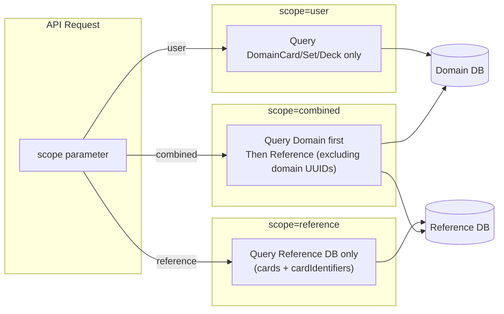

# Database Architecture Documentation

## Overview

The mtgsim project uses a three-database architecture with multiple data models, sync pipelines, and access layers. This document maps all database access points, models, and data flows.

---

## Database Files

| Database | Path | Purpose | Access Mode |
|----------|------|---------|-------------|
| **Reference DB** | `~/.mtgsim/reference/mtgjson/mtgjson-merged.sqlite` | Merged MTGJSON data (cards, sets, decks, prices) | Read-only |
| **Domain DB** | `~/.mtgsim/domain/mtgsim.sqlite` | User collection, enhanced models, migrations | Read-write |
| **Legacy User DB** | `~/.mtgsim/mtgsim.db` | Legacy card ownership tracking | Read-write (deprecated) |

### Source Files (MTGJSON)

| File | Path | Purpose |
|------|------|---------|
| AllPrintings.sqlite | `~/.mtgsim/reference/mtgjson/` | Card data from MTGJSON |
| AllDecks.sqlite | `~/.mtgsim/reference/mtgjson/` | Deck data from MTGJSON |
| AllSets.sqlite | `~/.mtgsim/reference/mtgjson/` | Set data from MTGJSON |
| AllPricesToday.sqlite | `~/.mtgsim/reference/mtgjson/` | Price data from MTGJSON |
| Keywords.json | `~/.mtgsim/reference/mtgjson/` | MTG keyword definitions |
| DeckList.json | `~/.mtgsim/reference/mtgjson/` | Index of available decks |
| AllDeckFiles/ | `~/.mtgsim/reference/mtgjson/` | Individual deck JSON files |

---

## Data Models

### Domain Models (`src/mtgsim/db/domain_models.py`)

| Model | Table | Description |
|-------|-------|-------------|
| `DomainCard` | `domain_card` | Enhanced card with pricing, legalities, ownership |
| `DomainSet` | `domain_set` | Set with statistics, translations |
| `DomainDeck` | `domain_deck` | Deck with color identity, mana curve |
| `DomainDeckCard` | `domain_deck_card` | Card entry in a deck |
| `DomainCardColorLink` | `domain_card_color_link` | Card-to-color M:N relationship |
| `DomainCardTypeLink` | `domain_card_type_link` | Card-to-type M:N relationship |
| `DomainCardSupertypeLink` | `domain_card_supertype_link` | Card-to-supertype M:N relationship |
| `DomainCardSubtypeLink` | `domain_card_subtype_link` | Card-to-subtype M:N relationship |

### Reference Models (`src/mtgsim/db/reference_models.py`)

| Model | Table | Description |
|-------|-------|-------------|
| `MTGJsonCard` | `mtgjson_card` | Reference copy of MTGJSON card data |
| `MTGJsonSet` | `mtgjson_set` | Reference copy of MTGJSON set data |
| `MTGJsonDeck` | `mtgjson_deck` | Reference copy of MTGJSON deck data |
| `MTGJsonDeckCard` | `mtgjson_deck_card` | Reference copy of deck card data |
| `MTGJsonPrice` | `mtgjson_price` | Reference copy of price data |

### Migration Models (`src/mtgsim/db/migration_models.py`)

| Model | Table | Description |
|-------|-------|-------------|
| `MigrationLog` | `migration_log` | Tracks migration operations, status, rollback data |
| `SchemaVersion` | `schema_version` | Domain database schema version tracking |
| `DataIntegrityCheck` | `data_integrity_check` | Data validation results |

### Legacy Models (`src/mtgsim/db/models.py`)

| Model | Table | Description |
|-------|-------|-------------|
| `CardDB` | `carddb` | Legacy card model with ownership |
| `CardColorLink` | `cardcolorlink` | Legacy color relationships |
| `CardTypeLink` | `cardtypelink` | Legacy type relationships |
| `CardSupertypeLink` | `cardsupertypelink` | Legacy supertype relationships |
| `CardSubtypeLink` | `cardsubtypelink` | Legacy subtype relationships |
| `CardLegalityLink` | `cardlegalitylink` | Legacy legality tracking |

### Other Models

| File | Models | Description |
|------|--------|-------------|
| `db/keyword_models.py` | `Keyword` | MTG keyword entries |
| `db/deck_models.py` | `DeckList`, `Deck`, `DeckCard` | Deck index and metadata |
| `db/set_models.py` | `SetDB`, `SetCardDB` | Set metadata and cards |

---

## Database Access Points

### Session Management

| File | Functions | Database |
|------|-----------|----------|
| `db/domain_session.py` | `get_domain_session()`, `init_domain_db()`, `get_domain_engine()` | Domain DB |
| `db/session.py` | `get_session()`, `init_db()`, `get_engine()` | Legacy User DB |
| `reference/db.py` | `ReferenceDb` class, `ref_db` singleton | Reference DB |

### API Data Layer (`src/mtgsim/api/data/`)

| File | Class | Queries | Description |
|------|-------|---------|-------------|
| `cards.py` | `CardsData` | `DomainCard`, `MTGJsonCard`, `cardIdentifiers` | Card search with scope control |
| `sets.py` | `SetsData` | `DomainSet`, `MTGJsonSet` | Set listing with filters |
| `decks.py` | `DecksData` | `DomainDeck`, `DomainDeckCard`, `MTGJsonDeck` | Deck access and pricing |
| `prices.py` | `PricesData` | `cardPrices` (ref DB) | Price lookup by provider |
| `keywords.py` | `KeywordsData` | `Keyword` | Keyword access |
| `converters.py` | - | - | Model-to-dict conversions |
| `database.py` | - | - | Re-exports `ref_db` singleton |

### API Services Layer (`src/mtgsim/api/services/`)

| File | Class | Uses |
|------|-------|------|
| `card_service.py` | `CardService` | `cards_data` |
| `set_service.py` | `SetService` | `sets_data` |
| `deck_service.py` | `DeckService` | `decks_data` |
| `price_service.py` | `PriceService` | `prices_data` |
| `stats_service.py` | `StatsService` | Multiple data sources |

### CLI Commands

| File | Commands | Database Operations |
|------|----------|---------------------|
| `cli/db_commands.py` | `db init`, `db sync`, `db sync-decks`, `db sync-sets` | Initialize and sync databases |
| `cli/domain_commands.py` | `domain migration-report`, `domain rollback` | Domain DB management |
| `cli/rollback.py` | `RollbackManager` | Backup/restore operations |
| `cli/card_commands.py` | Card operations | Legacy user DB |
| `cli/mtgjson_commands.py` | MTGJSON operations | Reference sync |

### Sync Operations (`src/mtgsim/sync/`)

| File | Functions | Description |
|------|-----------|-------------|
| `mtgjson.py` | `update_references()`, `update_decks()`, `update_sets()`, `update_keywords()` | Download and sync MTGJSON data |

---

## Data Flow Diagram

```mermaid
flowchart TB
    subgraph External["External Sources"]
        MTGJSON["MTGJSON API<br/>(mtgjson.com)"]
    end

    subgraph Sync["Sync Layer"]
        direction TB
        SyncMTG["sync/mtgjson.py<br/>update_references()<br/>update_decks()<br/>update_sets()"]
        Download["Download & Extract<br/>(.sqlite, .json files)"]
    end

    subgraph SourceFiles["Source Files (~/.mtgsim/reference/mtgjson/)"]
        AllPrintings["AllPrintings.sqlite"]
        AllDecks["AllDecks.sqlite"]
        AllSets["AllSets.sqlite"]
        AllPrices["AllPricesToday.sqlite"]
        DeckFiles["AllDeckFiles/*.json"]
        Keywords["Keywords.json"]
    end

    subgraph Databases["Databases"]
        RefDB[("Reference DB<br/>mtgjson-merged.sqlite<br/><i>Read-only</i>")]
        DomainDB[("Domain DB<br/>domain/mtgsim.sqlite<br/><i>Read-write</i>")]
        LegacyDB[("Legacy User DB<br/>mtgsim.db<br/><i>Deprecated</i>")]
    end

    subgraph RefTables["Reference DB Tables"]
        cards["cards"]
        cardIdentifiers["cardIdentifiers"]
        cardPrices["cardPrices"]
        cardLegalities["cardLegalities"]
        sets["sets / setdb"]
        deck["deck"]
        deckcard["deckcard"]
    end

    subgraph DomainTables["Domain DB Tables"]
        domain_card["domain_card"]
        domain_set["domain_set"]
        domain_deck["domain_deck"]
        domain_deck_card["domain_deck_card"]
        mtgjson_card["mtgjson_card"]
        mtgjson_set["mtgjson_set"]
        migration_log["migration_log"]
    end

    subgraph DataAccess["API Data Access Layer"]
        CardsData["cards.py<br/>CardsData"]
        SetsData["sets.py<br/>SetsData"]
        DecksData["decks.py<br/>DecksData"]
        PricesData["prices.py<br/>PricesData"]
    end

    subgraph Services["API Services Layer"]
        CardService["CardService"]
        SetService["SetService"]
        DeckService["DeckService"]
        PriceService["PriceService"]
        StatsService["StatsService"]
    end

    subgraph API["FastAPI Application"]
        Routers["API Routers<br/>/api/cards<br/>/api/sets<br/>/api/decks<br/>/api/prices"]
    end

    subgraph CLI["CLI Commands"]
        DBCmd["db_commands.py<br/>db init / sync"]
        DomainCmd["domain_commands.py<br/>migration-report / rollback"]
        RollbackMgr["rollback.py<br/>RollbackManager"]
    end

    subgraph Sessions["Session Management"]
        RefDbSingleton["reference/db.py<br/>ref_db singleton"]
        DomainSession["domain_session.py<br/>get_domain_session()"]
        LegacySession["session.py<br/>get_session()"]
    end

    %% External to Sync
    MTGJSON --> SyncMTG
    SyncMTG --> Download
    Download --> AllPrintings
    Download --> AllDecks
    Download --> AllSets
    Download --> AllPrices
    Download --> DeckFiles
    Download --> Keywords

    %% Source files to Reference DB (merged)
    AllPrintings --> RefDB
    AllDecks --> RefDB
    AllSets --> RefDB
    AllPrices --> RefDB

    %% Reference DB structure
    RefDB --> cards
    RefDB --> cardIdentifiers
    RefDB --> cardPrices
    RefDB --> cardLegalities
    RefDB --> sets
    RefDB --> deck
    RefDB --> deckcard

    %% Domain DB structure
    DomainDB --> domain_card
    DomainDB --> domain_set
    DomainDB --> domain_deck
    DomainDB --> domain_deck_card
    DomainDB --> mtgjson_card
    DomainDB --> mtgjson_set
    DomainDB --> migration_log

    %% Session connections
    RefDbSingleton -.-> RefDB
    DomainSession -.-> DomainDB
    LegacySession -.-> LegacyDB

    %% Data Access to Sessions
    CardsData --> RefDbSingleton
    CardsData --> DomainSession
    SetsData --> RefDbSingleton
    SetsData --> DomainSession
    DecksData --> RefDbSingleton
    DecksData --> DomainSession
    PricesData --> RefDbSingleton

    %% Services to Data Access
    CardService --> CardsData
    SetService --> SetsData
    DeckService --> DecksData
    PriceService --> PricesData
    StatsService --> CardsData
    StatsService --> SetsData
    StatsService --> DecksData

    %% API to Services
    Routers --> CardService
    Routers --> SetService
    Routers --> DeckService
    Routers --> PriceService
    Routers --> StatsService

    %% CLI connections
    DBCmd --> SyncMTG
    DBCmd --> LegacySession
    DomainCmd --> DomainSession
    RollbackMgr --> DomainSession
```

---

## Scope-Based Query Flow

The API supports three scopes for queries: `user`, `reference`, and `combined`.

---

## Test Database Usage

| Test File | Database Usage |
|-----------|----------------|
| `tests/api/conftest.py` | `setup_databases()` fixture initializes/closes DBs |
| `tests/test_sync_*.py` | Tests sync operations against real DBs |
| `tests/test_domain_*.py` | Tests domain model operations |
| `tests/test_migration_*.py` | Tests migration and rollback |
| `tests/test_reference_*.py` | Tests reference table queries |

---

## Key Observations

### Complexity Issues

1. **Three separate databases** with overlapping data (Reference, Domain, Legacy)
2. **Duplicate models** - `MTGJsonCard` in domain DB mirrors data from Reference DB
3. **Multiple session factories** - `ref_db`, `get_domain_session()`, `get_session()`
4. **Scope parameter** adds complexity to every query
5. **Link tables** for M:N relationships (colors, types, subtypes, supertypes)
6. **Migration infrastructure** adds overhead (MigrationLog, SchemaVersion, rollback)

### Data Duplication

- Reference data exists in:
  - Source SQLite files (AllPrintings.sqlite, etc.)
  - Merged reference database (mtgjson-merged.sqlite)
  - Domain database reference tables (mtgjson_card, mtgjson_set)

### Potential Simplifications

1. Use single database with clear table prefixes
2. Remove duplicate reference tables from domain DB
3. Simplify or remove scope parameter if not needed
4. Consider removing legacy user DB
5. Reduce link tables if JSON columns suffice
