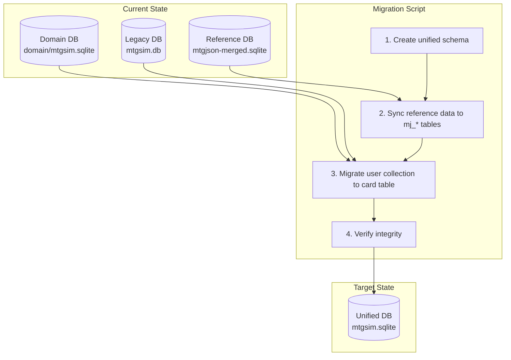

# Database Simplification Plan

## Executive Summary

This plan consolidates the current three-database architecture into a single, unified database with clear separation between reference data (read-only MTGJSON) and user data (collection, preferences). The goal is to reduce complexity, eliminate data duplication, and simplify the codebase.

---

## Current State Problems

### 1. Three Separate Databases
| Database | Tables | Purpose | Issue |
|----------|--------|---------|-------|
| Reference DB | 15+ tables | MTGJSON data | Duplicated in Domain DB |
| Domain DB | 20+ tables | User collection + MTGJSON copy | Redundant reference tables |
| Legacy User DB | 10+ tables | Old collection tracking | Deprecated but still wired |

### 2. Data Duplication
Reference card data exists in **three places**:
- Source MTGJSON SQLite files (AllPrintings.sqlite, etc.)
- Merged reference database (mtgjson-merged.sqlite)
- Domain database tables (mtgjson_card, mtgjson_set, etc.)

### 3. Complexity Overhead
- **Scope parameter** on every query (`user`/`reference`/`combined`)
- **8 link tables** for M:N relationships (could use JSON)
- **Migration infrastructure** (MigrationLog, SchemaVersion, rollback) adds overhead
- **Three session factories** with different patterns

### 4. Code Duplication
- Similar queries repeated across cards.py, sets.py, decks.py
- Model conversion logic scattered across converters, services, data layers

---

## Target Architecture

### Single Database Design

```
~/.mtgsim/mtgsim.sqlite
├── Reference Tables (MJ prefix - synced from MTGJSON, read-only)
│   ├── mj_card              # All cards from AllPrintings
│   ├── mj_card_identifier   # Scryfall IDs, TCGPlayer IDs, etc.
│   ├── mj_card_legality     # Format legality
│   ├── mj_card_price        # Current prices
│   ├── mj_set               # All sets
│   ├── mj_deck              # All precon decks
│   └── mj_deck_card         # Cards in precon decks
│
└── User Tables (no prefix - user-modifiable)
    ├── card                 # User collection (owns + wants in one table)
    ├── deck                 # User-created decks
    └── deck_card            # Cards in user decks
```

### Key Changes

1. **Single database file** instead of three
2. **No model duplication** - reference tables queried directly
3. **No scope parameter** - queries naturally join user + reference
4. **JSON columns** for arrays (colors, types) - no link tables
5. **Minimal user tables** - only track what differs from reference
6. **Clear naming** - `MJ` prefix for MTGJSON reference, no prefix for user data

---

## Data Model Simplification

### Before: 25+ Models

```
Domain Models (8):
  DomainCard, DomainSet, DomainDeck, DomainDeckCard
  + 4 link tables (colors, types, subtypes, supertypes)

Reference Models (5):
  MTGJsonCard, MTGJsonSet, MTGJsonDeck, MTGJsonDeckCard, MTGJsonPrice

Migration Models (3):
  MigrationLog, SchemaVersion, DataIntegrityCheck

Legacy Models (6+):
  CardDB + 5 link tables
```

### After: 10 Models

```
Reference Models (7) - MJ prefix, read-only, synced from MTGJSON:
  MJCard, MJCardIdentifier, MJCardLegality, MJCardPrice
  MJSet, MJDeck, MJDeckCard

User Models (3) - No prefix, user-modifiable:
  Card       # Collection entry (owns + wants combined)
  Deck       # User custom deck
  DeckCard   # Card in user deck
```

### Model Naming Convention

| Type | Prefix | Example | Table Name |
|------|--------|---------|------------|
| Reference (MTGJSON) | `MJ` | `MJCard` | `mj_card` |
| User data | None | `Card` | `card` |

### Simplified Models

```python
class MJCard(SQLModel, table=True):
    """Card from MTGJSON - read-only reference data."""
    __tablename__ = "mj_card"

    uuid: str = Field(primary_key=True)
    name: str = Field(index=True)
    set_code: str = Field(index=True)
    mana_cost: str | None
    mana_value: float | None
    type_line: str | None
    oracle_text: str | None
    rarity: str | None

    # JSON columns instead of link tables
    colors: list[str] = Field(sa_column=Column(JSON), default=[])
    color_identity: list[str] = Field(sa_column=Column(JSON), default=[])
    types: list[str] = Field(sa_column=Column(JSON), default=[])
    subtypes: list[str] = Field(sa_column=Column(JSON), default=[])
    supertypes: list[str] = Field(sa_column=Column(JSON), default=[])
    keywords: list[str] = Field(sa_column=Column(JSON), default=[])

    # Stats
    power: str | None
    toughness: str | None
    loyalty: str | None


class Card(SQLModel, table=True):
    """User's collection entry - owns AND wants in one table."""
    __tablename__ = "card"

    id: int = Field(primary_key=True)
    card_uuid: str = Field(foreign_key="mj_card.uuid", index=True)

    # Ownership tracking
    quantity_owned: int = 0
    quantity_owned_foil: int = 0

    # Wishlist tracking (no separate table)
    quantity_wanted: int = 0
    quantity_wanted_foil: int = 0

    # Optional metadata
    condition: str = "NM"
    purchase_price: float | None
    notes: str | None
    added_at: datetime

    @property
    def owns(self) -> bool:
        return (self.quantity_owned + self.quantity_owned_foil) > 0

    @property
    def wants(self) -> bool:
        return (self.quantity_wanted + self.quantity_wanted_foil) > 0
```

---

## Implementation Phases

### Phase 1: Create Unified Database Schema
> **Detailed plan**: See `PHASE1_UNIFIED_SCHEMA.md`

**Goal**: Define new simplified schema, create models and session

**Tasks**:
1. Create `src/mtgsim/db/models.py` with unified models (MJ* + user)
2. Create `src/mtgsim/db/session.py` with single session factory
3. Update `config.py` with new database path
4. Add `mtgsim db init` command to create schema

**Files to create/modify**:
- `src/mtgsim/db/models.py` (new unified models)
- `src/mtgsim/db/session.py` (new unified session)
- `src/mtgsim/config.py` (add DB_PATH)
- `tests/test_unified_schema.py` (validation tests)

---

### Phase 2: Simplify Data Access Layer

**Goal**: Single data access pattern, remove scope parameter

**Tasks**:
1. Create unified data access module with queries against new schema
2. Queries join `mj_card` + `card` automatically for collection status
3. Remove scope parameter from all data access functions
4. Build image URLs from `mj_card_identifier.scryfall_id`
5. Get prices from `mj_card_price`

**New query pattern**:
```python
def get_cards(q: str = None, set_code: str = None, ...):
    """Get cards with collection status."""
    query = """
        SELECT c.*, ci.scryfall_id,
               COALESCE(col.quantity_owned, 0) + COALESCE(col.quantity_owned_foil, 0) as total_owned,
               COALESCE(col.quantity_wanted, 0) + COALESCE(col.quantity_wanted_foil, 0) as total_wanted,
               (col.id IS NOT NULL AND (col.quantity_owned > 0 OR col.quantity_owned_foil > 0)) as owns,
               (col.id IS NOT NULL AND (col.quantity_wanted > 0 OR col.quantity_wanted_foil > 0)) as wants
        FROM mj_card c
        LEFT JOIN mj_card_identifier ci ON c.uuid = ci.card_uuid
        LEFT JOIN card col ON c.uuid = col.card_uuid
        WHERE 1=1
    """
    # Add filters...
    return execute(query, params)
```

**Files to modify**:
- `src/mtgsim/api/data/cards.py` - Update to query `mj_card` + `card`
- `src/mtgsim/api/data/sets.py` - Update to query `mj_set`
- `src/mtgsim/api/data/decks.py` - Update to query `mj_deck` + `deck`
- `src/mtgsim/api/data/prices.py` - Update to query `mj_card_price`

---

### Phase 3: Update API Layer

**Goal**: Remove scope parameter from API, simplify response models

**Tasks**:
1. Remove `scope` parameter from all router endpoints
2. Update response models to include `owns`, `wants`, `total_owned`, `total_wanted`
3. Simplify or remove services layer (thin wrappers not needed)
4. Update Hurl tests for new behavior

**API changes**:
```
# Before
GET /api/cards?scope=reference&q=Lightning
GET /api/cards?scope=user&q=Lightning

# After
GET /api/cards?q=Lightning
GET /api/cards?q=Lightning&owns=true      # Filter to owned cards
GET /api/cards?q=Lightning&wants=true     # Filter to wanted cards
```

**Response changes**:
```json
{
  "uuid": "abc-123",
  "name": "Lightning Bolt",
  "owns": true,
  "wants": false,
  "total_owned": 4,
  "total_wanted": 0,
  "collection": {
    "quantity_owned": 3,
    "quantity_owned_foil": 1,
    "quantity_wanted": 0,
    "quantity_wanted_foil": 0
  }
}
```

**Files to modify**:
- `src/mtgsim/api/routers/cards.py`
- `src/mtgsim/api/routers/sets.py`
- `src/mtgsim/api/routers/decks.py`
- `src/mtgsim/api/models/card.py`
- `src/mtgsim/api/services/*.py` (simplify or remove)
- `tests/hurl/*.hurl`

---

### Phase 4: Simplify Sync Pipeline

**Goal**: Sync writes directly to unified database

**Tasks**:
1. Update sync to write to `mj_*` tables in unified database
2. Remove merged database creation step
3. Simplify to single `mtgsim db sync` command
4. Use REPLACE INTO for idempotent sync

**Sync flow**:
```
MTGJSON downloads (AllPrintings.sqlite, etc.)
    ↓
Parse and transform
    ↓
Write to mj_* tables in ~/.mtgsim/mtgsim.sqlite
```

**Files to modify**:
- `src/mtgsim/sync/mtgjson.py`
- `src/mtgsim/cli/db_commands.py`

---

### Phase 5: Remove Legacy Code

**Goal**: Delete obsolete code, clean up

**Tasks**:
1. Delete all legacy/domain/reference model files
2. Delete old session factories
3. Delete migration infrastructure
4. Remove obsolete CLI commands
5. Update all imports throughout codebase

**Files to delete**:
```
src/mtgsim/db/models_legacy.py      # After migration verified
src/mtgsim/db/session_legacy.py     # After migration verified
src/mtgsim/db/domain_models.py
src/mtgsim/db/domain_session.py
src/mtgsim/db/reference_models.py
src/mtgsim/db/migration_models.py
src/mtgsim/db/keyword_models.py
src/mtgsim/db/deck_models.py
src/mtgsim/db/set_models.py
src/mtgsim/reference/db.py
src/mtgsim/cli/domain_commands.py
src/mtgsim/cli/rollback.py
src/mtgsim/cli/logging_manager.py
src/mtgsim/api/data/converters.py
```

---

## Migration Strategy

### Data Migration Flow



### Collection Migration

User collection data needs to be migrated from legacy format to new `card` table:

```sql
-- From legacy CardDB or DomainCard
INSERT INTO card (card_uuid, quantity_owned, quantity_owned_foil, quantity_wanted, ...)
SELECT
    uuid,
    COALESCE(quantity, 1) as quantity_owned,
    0 as quantity_owned_foil,
    CASE WHEN is_wanted THEN 1 ELSE 0 END as quantity_wanted,
    ...
FROM legacy_card_table
WHERE is_owned = 1 OR is_wanted = 1;
```

### Rollback Plan

1. Keep old databases until migration verified
2. Add `--dry-run` flag to migration script
3. Backup user data before migration
4. Version the database schema

---

## Metrics

### Before
| Metric | Value |
|--------|-------|
| Database files | 3 |
| SQLModel classes | 25+ |
| Session factories | 3 |
| Link tables | 8 |
| Lines in data layer | ~2000 |

### After (Target)
| Metric | Value |
|--------|-------|
| Database files | 1 |
| SQLModel classes | 10 |
| Session factories | 1 |
| Link tables | 0 |
| Lines in data layer | ~500 |

---

## Risk Mitigation

| Risk | Mitigation |
|------|------------|
| Data loss during migration | Backup all DBs, dry-run mode, keep originals |
| Breaking API changes | Version API, deprecation period for scope param |
| Performance regression | Benchmark queries before/after, add indexes |
| Incomplete migration | Checksums on record counts, integrity tests |

---

## Testing Strategy

1. **Unit tests** for new models and data access
2. **Migration tests** - verify data integrity post-migration
3. **API tests** - update Hurl tests for new behavior
4. **Performance tests** - compare query times

---

## Appendix: File Change Summary

### New Files
```
src/mtgsim/db/models.py          # Unified models (MJ* + user)
src/mtgsim/db/session.py         # Unified session factory
tests/test_unified_schema.py     # Schema tests
scripts/migrate_to_unified.py    # Migration script
```

### Modified Files
```
src/mtgsim/config.py
src/mtgsim/api/data/cards.py
src/mtgsim/api/data/sets.py
src/mtgsim/api/data/decks.py
src/mtgsim/api/data/prices.py
src/mtgsim/api/routers/*.py
src/mtgsim/api/models/*.py
src/mtgsim/sync/mtgjson.py
src/mtgsim/cli/db_commands.py
tests/hurl/*.hurl
```

### Deleted Files (Phase 5)
```
src/mtgsim/db/domain_models.py
src/mtgsim/db/domain_session.py
src/mtgsim/db/reference_models.py
src/mtgsim/db/migration_models.py
src/mtgsim/db/keyword_models.py
src/mtgsim/db/deck_models.py
src/mtgsim/db/set_models.py
src/mtgsim/reference/db.py
src/mtgsim/cli/domain_commands.py
src/mtgsim/cli/rollback.py
src/mtgsim/cli/logging_manager.py
src/mtgsim/api/data/converters.py
```
