# MTG Webapp Architecture Documentation

This document provides a comprehensive overview of the MTG Deck Viewer webapp architecture, including the API backend and web frontend.

## System Overview

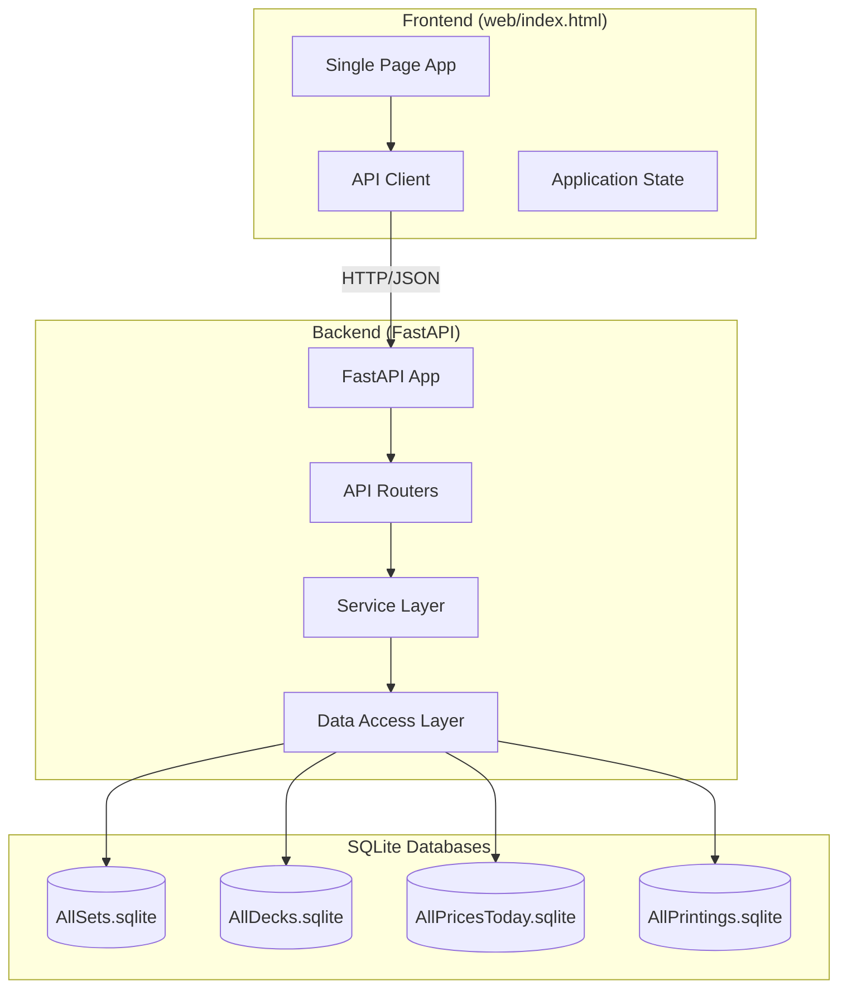

## Backend Architecture

### Layer Structure

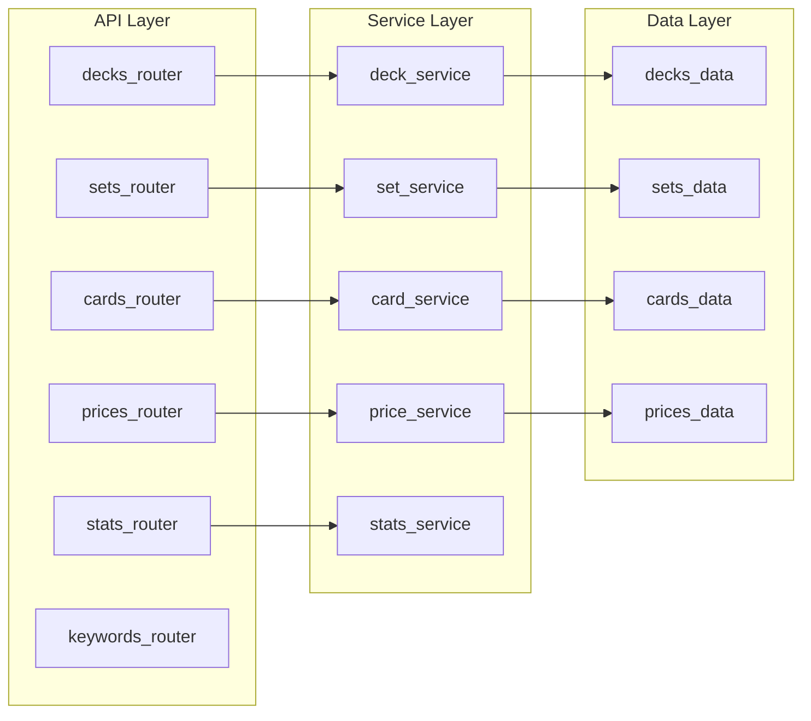

### File Structure

```
src/mtgsim/api/
├── main.py              # FastAPI app, lifespan, routing
├── cli.py               # CLI entry point
├── routers/
│   ├── decks.py         # /api/decks endpoints
│   ├── sets.py          # /api/sets endpoints
│   ├── cards.py         # /api/cards endpoints
│   ├── prices.py        # /api/prices endpoints
│   ├── stats.py         # /api/stats endpoints
│   └── keywords.py      # /api/keywords endpoints
├── services/
│   ├── deck_service.py  # Deck business logic
│   ├── set_service.py   # Set business logic
│   ├── card_service.py  # Card business logic
│   ├── price_service.py # Price business logic
│   └── stats_service.py # Statistics aggregation
├── data/
│   ├── database.py      # DatabaseManager singleton
│   ├── decks.py         # Deck SQL queries
│   ├── sets.py          # Set SQL queries
│   ├── cards.py         # Card SQL queries
│   ├── prices.py        # Price SQL queries
│   └── keywords.py      # Keyword data
└── models/
    ├── common.py        # Pagination, errors
    ├── deck.py          # Deck models
    ├── set.py           # Set models
    ├── card.py          # Card models
    └── price.py         # Price models
```

### Database Manager

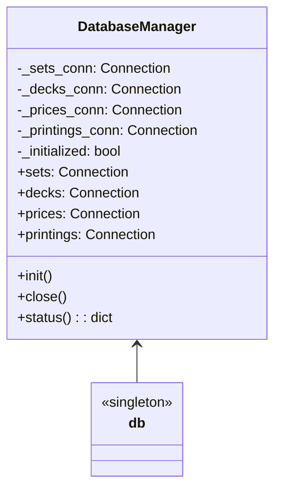

**Database Files Location:** `~/.mtgsim/reference/mtgjson/`

| Database | Contents |
|----------|----------|
| AllSets.sqlite | Set metadata, card data (setdb, setcarddb tables) |
| AllDecks.sqlite | Deck metadata, deck cards (deck, deckcard tables) |
| AllPricesToday.sqlite | Daily prices (cardPrices table) |
| AllPrintings.sqlite | Complete card printings data |

## API Endpoints

### Decks API

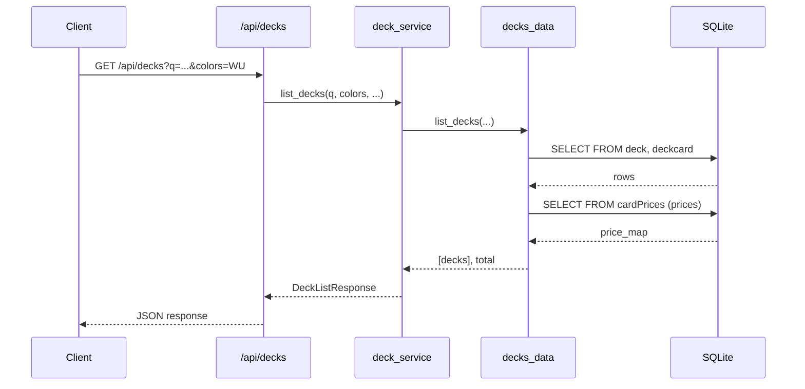

**Endpoints:**
- `GET /api/decks` - List/filter decks with pagination
- `GET /api/decks/{file}` - Get full deck details
- `GET /api/decks/{file}/raw` - Get raw deck JSON

**Query Parameters:**
| Parameter | Description |
|-----------|-------------|
| q | Search deck name/code |
| format | Filter by format (standard, modern, etc.) |
| set | Filter by set code |
| colors | Filter by color identity (e.g., "WU") |
| card_count_min/max | Filter by deck size |
| price_min/max | Filter by price range |
| sort | Sort field (name, release_date, card_count) |
| order | asc/desc |
| page, limit | Pagination |

### Sets API

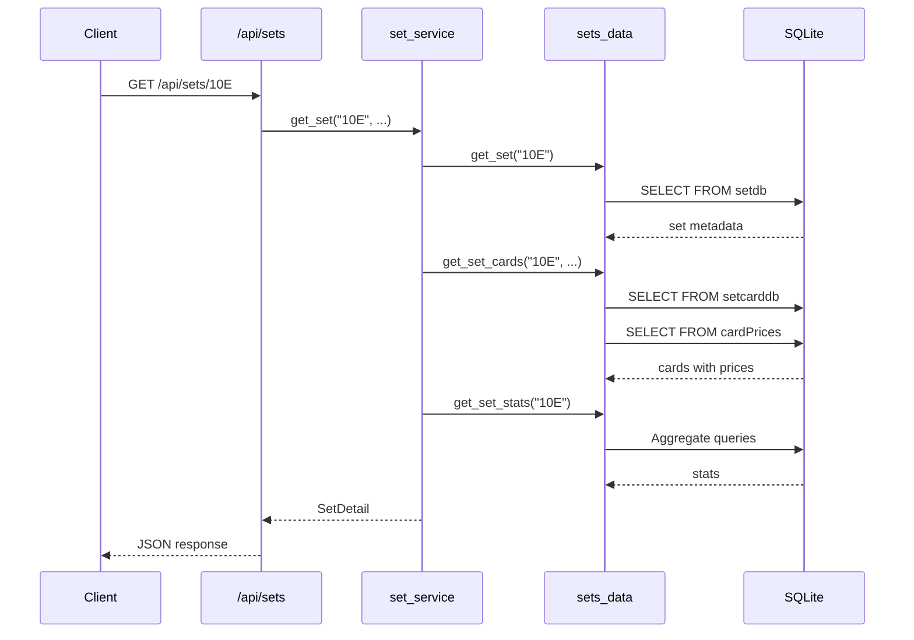

**Endpoints:**
- `GET /api/sets` - List/filter sets
- `GET /api/sets/{code}` - Get set details with cards
- `GET /api/sets/{code}/raw` - Get raw set JSON

### Cards API

**Endpoints:**
- `GET /api/cards` - Search cards with filters
- `GET /api/cards/{uuid}` - Get card details

### Prices API

**Endpoints:**
- `GET /api/prices` - Search prices
- `GET /api/prices/{uuid}` - Get card prices

### Stats API

**Endpoints:**
- `GET /api/stats/home` - Home screen statistics
- `GET /api/stats/decks` - Deck aggregate stats

## Frontend Architecture

### Application Structure

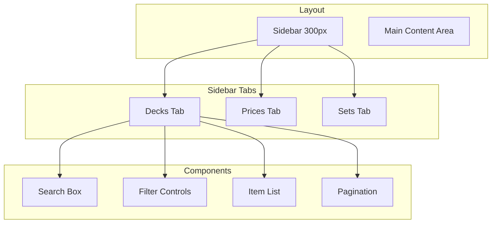

### State Management

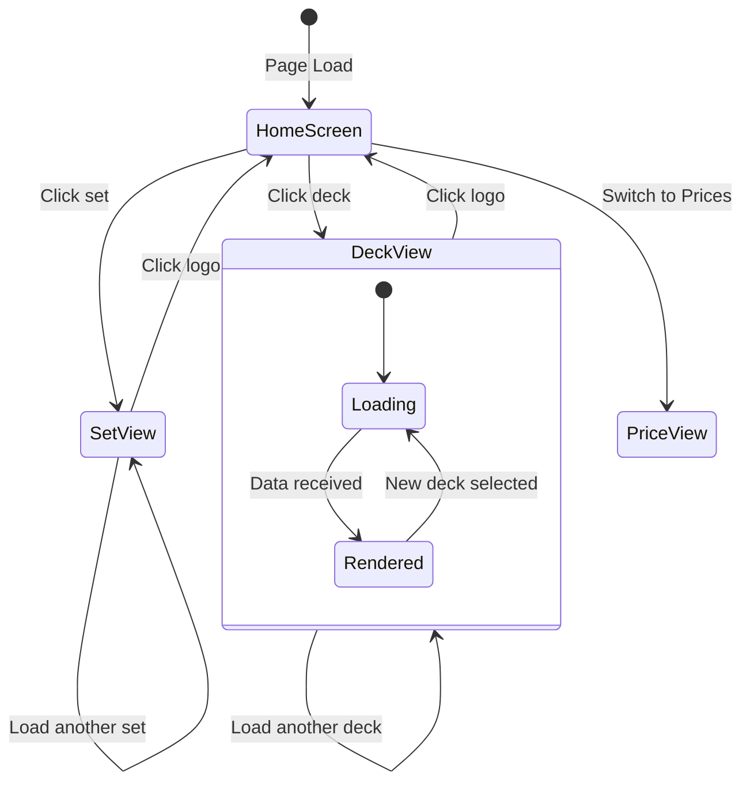

### JavaScript Functions

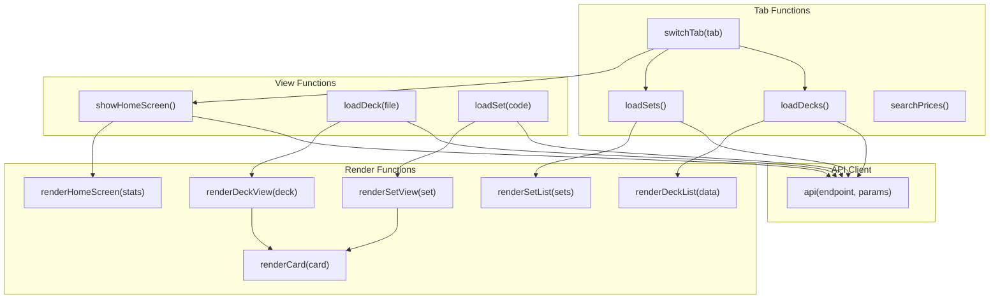

### Filter Flow (Decks Tab)

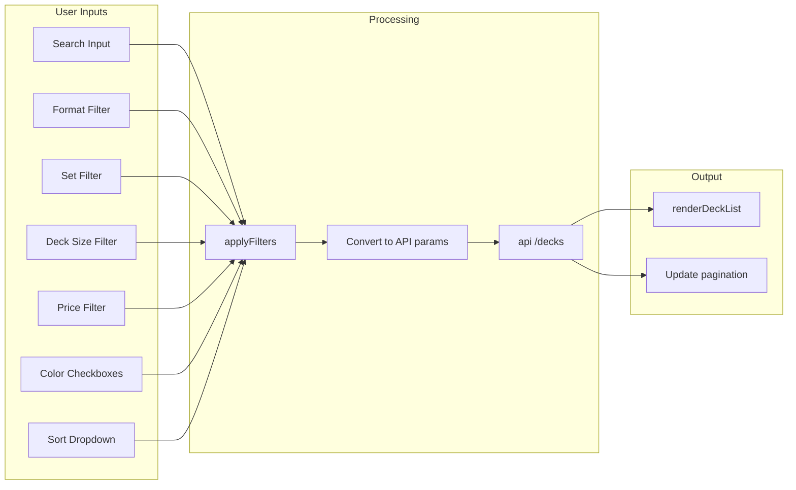

### Card Count Filter Mapping

| Filter Value | card_count_min | card_count_max |
|--------------|----------------|----------------|
| lands5 | 5 | 5 |
| sample | 6 | 20 |
| limited | 21 | 50 |
| constructed | 51 | 75 |
| commander | 76 | 115 |
| large | 116 | 299 |
| cube | 300 | null |

## Data Flow Examples

### Loading a Deck

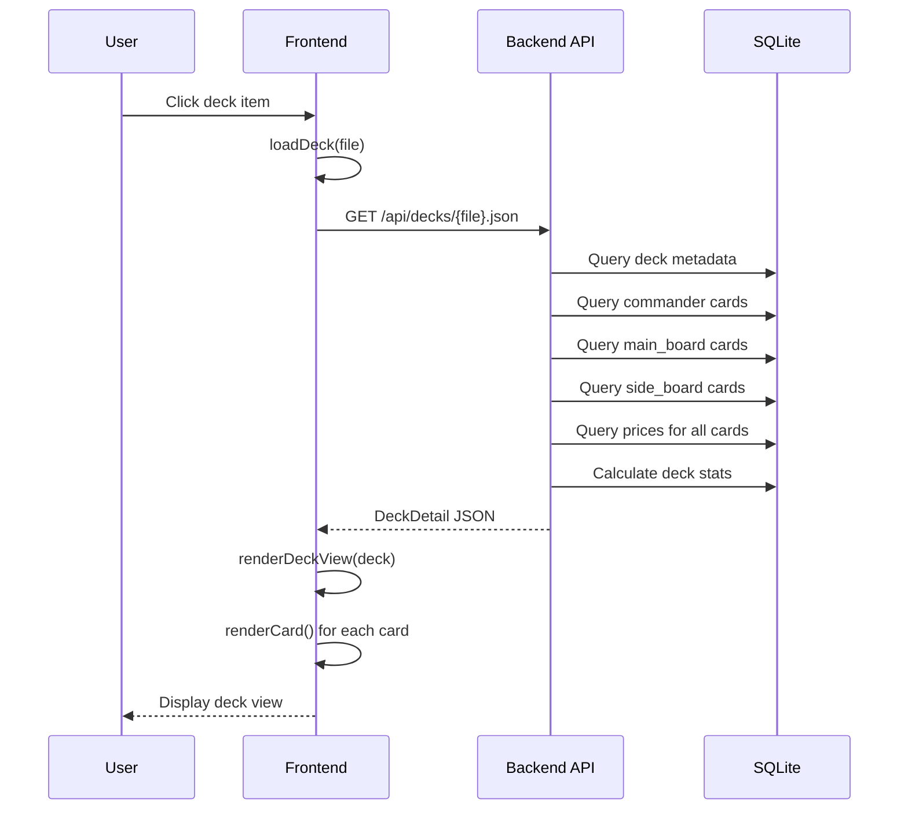

### Price Lookup

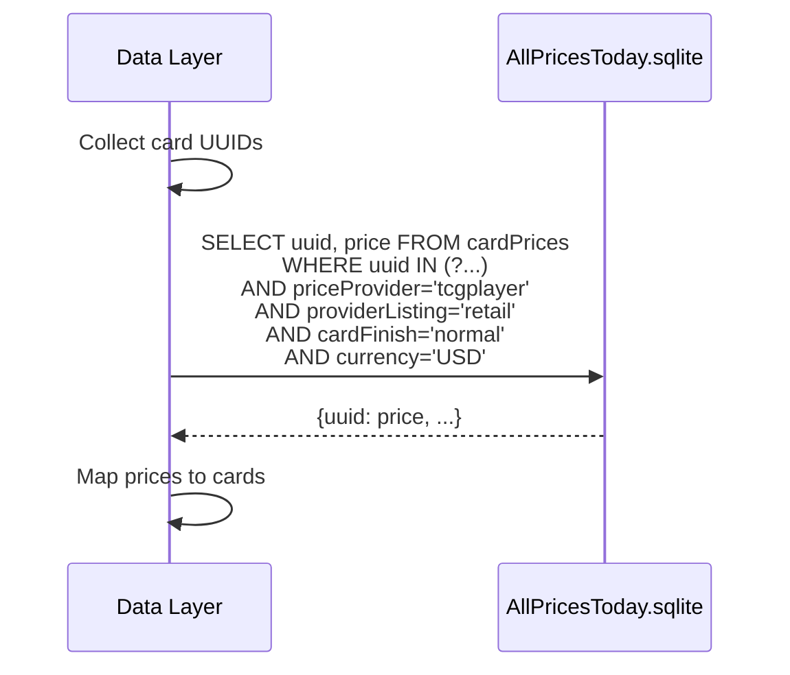

## UI Components

### Card Rendering

```html
<div class="card">
    
    <div class="card-header">
        <span class="card-name">Card Name</span>
        <span class="card-mana">{2}{W}{U}</span>
    </div>
    <div class="card-type">Creature - Human Wizard</div>
    <div class="card-text">Card rules text...</div>
    <div class="card-stats">
        <span class="card-pt">2/2</span>
        <div>
            <span class="card-count">x4</span>
            <i class="ss ss-set"></i> SET
            <span class="card-rarity">rare</span>
        </div>
    </div>
    <div class="card-footer">
        <div class="color-identity">W U</div>
        <div class="card-price">$1.50</div>
    </div>
</div>
```

### Image URL Generation

Card images are fetched from Scryfall using the scryfallId:
```
https://cards.scryfall.io/large/front/{id[0]}/{id[1]}/{scryfallId}.jpg
```

## External Dependencies

### CSS Libraries
- **Keyrune** - Set symbols (`ss-xxx` classes)
- **Mana** - Mana symbols (`ms-xxx` classes)

### JavaScript Libraries
- **D3.js v7** - Histograms and charts
- **d3-cloud** - Word clouds (keywords)

## Configuration

### CORS
Configured to allow all origins (development mode):
```python
app.add_middleware(
    CORSMiddleware,
    allow_origins=["*"],
    allow_credentials=True,
    allow_methods=["*"],
    allow_headers=["*"],
)
```

### Static Files
- `/web` - Main webapp files
- `/resources` - Keyrune, Mana CSS
- `/webapp` - Legacy webapp
- `/app` - Serves web/index.html

## Error Handling

### API Errors
```json
{
    "error": {
        "code": "NOT_FOUND",
        "message": "Resource not found"
    }
}
```

### Frontend Error Handling
```javascript
try {
    const data = await api('/endpoint');
    renderData(data);
} catch (error) {
    console.error('Error:', error);
    showErrorMessage();
}
```
