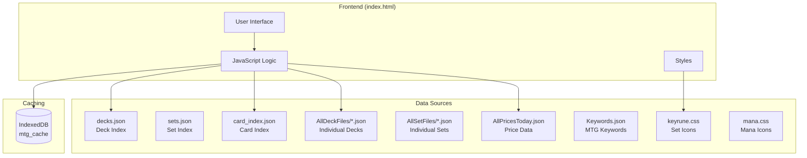
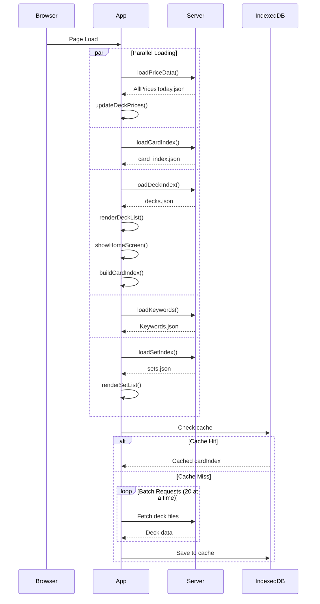
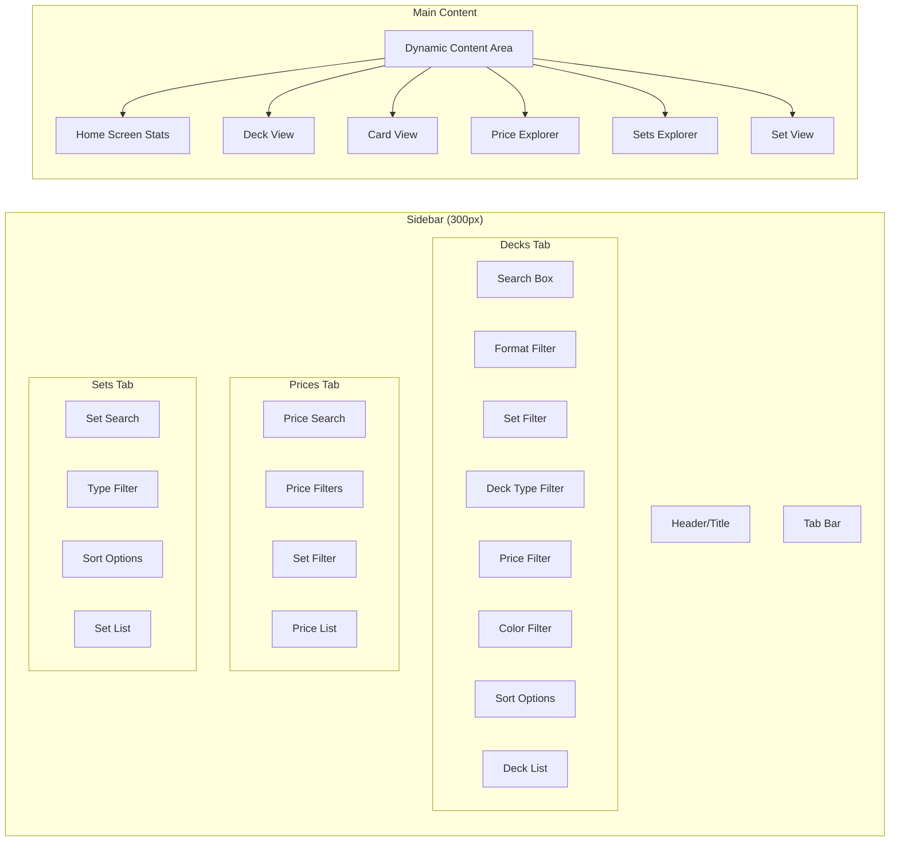
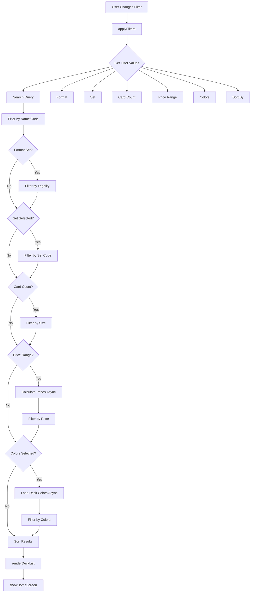
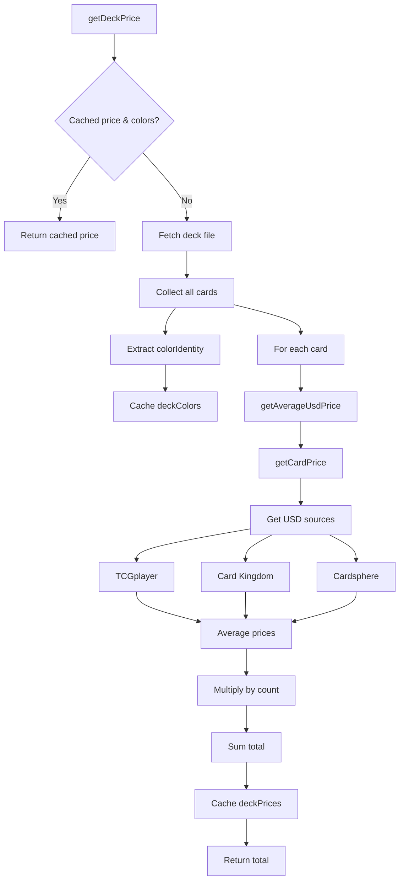
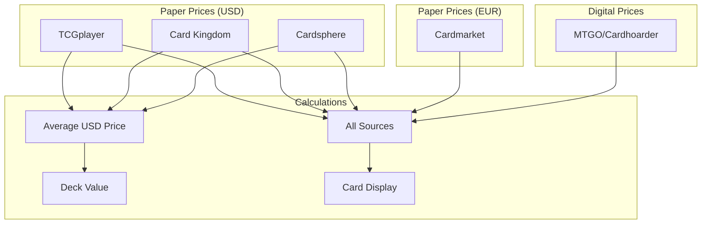
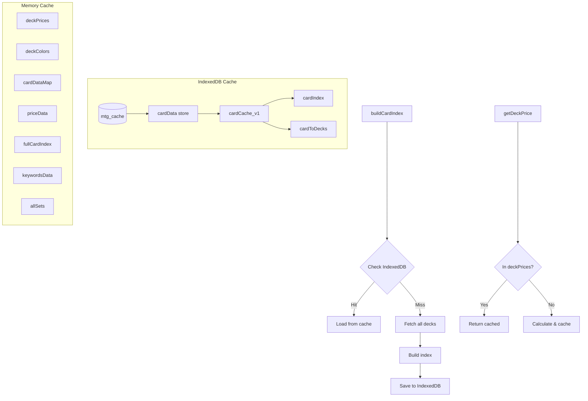
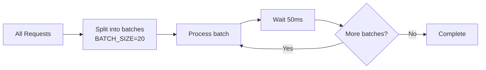

# MTG Deck Viewer Webapp

A single-page web application for browsing Magic: The Gathering decks, sets, and cards with price tracking.

## Architecture Overview



## File Structure

| File | Purpose |
|------|---------|
| `index.html` | Main single-page application |
| `decks.json` | Pre-generated deck index with metadata |
| `sets.json` | Pre-generated set index with metadata |
| `card_index.json` | Compact card data from SQLite database |
| `generate_index.py` | Script to generate `decks.json` |
| `generate_set_index.py` | Script to generate `sets.json` |
| `generate_card_index.py` | Script to generate `card_index.json` |

## Initialization Flow



## UI Components



## Data Flow

### Deck Filtering



### Sort Options

| Sort Key | Description |
|----------|-------------|
| `name` | Alphabetical A-Z |
| `name-desc` | Alphabetical Z-A |
| `release-new` | Newest release first |
| `release-old` | Oldest release first |
| `cards-high` | Most cards first |
| `cards-low` | Fewest cards first |
| `colors-few` | Mono-color decks first |
| `colors-many` | 5-color decks first |

### Price & Color Calculation



## Price Sources



## Caching System



## Key Functions

### Data Loading

| Function | Purpose |
|----------|---------|
| `loadPriceData()` | Fetches AllPricesToday.json |
| `loadCardIndex()` | Fetches card_index.json |
| `loadDeckIndex()` | Fetches decks.json, triggers UI init |
| `loadSetIndex()` | Fetches sets.json, renders set list |
| `loadKeywords()` | Fetches Keywords.json for word clouds |
| `buildCardIndex()` | Builds card-to-deck mapping with caching |

### Price Functions

| Function | Purpose |
|----------|---------|
| `getCardPrice(uuid)` | Gets all price sources for a card |
| `getAverageUsdPrice(uuid)` | Averages USD paper prices |
| `getDeckPrice(deckFile)` | Calculates deck value and caches colors |
| `formatPrice(price)` | Formats price for display |
| `updateDeckPrices()` | Updates sidebar with prices |

### Rendering Functions

| Function | Purpose |
|----------|---------|
| `renderDeckList(decks)` | Renders deck list with mana icons and prices |
| `renderDeck(deckData)` | Renders full deck view |
| `renderCard(card)` | Renders individual card |
| `renderDeckStats(stats)` | Renders deck statistics with word clouds |
| `showHomeScreen()` | Shows aggregate statistics |
| `showPriceCard(uuid)` | Shows card in price explorer |
| `renderWordCloud(selector, texts, w, h)` | D3 word cloud for rules/flavor text |
| `renderKeywordCloud(selector, counts, w, h)` | D3 word cloud for keyword frequencies |
| `renderPriceHistogram(prices)` | D3 histogram of card prices |
| `renderSetList(sets)` | Renders set list in sidebar |
| `renderSetView(setData)` | Renders full set view with cards |
| `showSetsExplorer()` | Shows sets home screen with stats |

### Filter/Search Functions

| Function | Purpose |
|----------|---------|
| `applyFilters()` | Applies all deck filters including colors |
| `applySetFilters()` | Filters and sorts set list |
| `searchPrices()` | Searches price database with set filter |
| `switchTab(tab)` | Switches between Decks/Prices/Sets tabs |
| `loadSet(setCode)` | Loads and displays a specific set |
| `populatePriceSetFilter()` | Populates set dropdown in price explorer |

## Card Data Format

### Full Format (from deck files)
```javascript
{
    uuid: "abc-123",
    name: "Lightning Bolt",
    manaCost: "{R}",
    manaValue: 1,
    type: "Instant",
    types: ["Instant"],
    rarity: "common",
    setCode: "M10",
    power: null,
    toughness: null,
    colorIdentity: ["R"],
    legalities: { standard: "Legal", ... },
    identifiers: { scryfallId: "xyz" }
}
```

### Compact Format (from card_index.json)
```javascript
{
    n: "Lightning Bolt",  // name
    t: "Instant",         // type
    m: "{R}",            // manaCost
    r: "common",         // rarity
    s: "M10",            // setCode
    p: null,             // power
    o: null,             // toughness
    c: ["R"],            // colorIdentity
    i: "xyz"             // scryfallId
}
```

## Rate Limiting

To prevent `ERR_INSUFFICIENT_RESOURCES` errors, network requests are batched:



## Generating Data Files

### Generate Deck Index
```bash
cd webapp
python generate_index.py
```
Reads all deck files from `resources/AllDeckFiles/` and creates `decks.json` with:
- Deck name, file, code
- Card count
- Format legality
- Release date

### Generate Set Index
```bash
cd webapp
python generate_set_index.py
```
Reads all set files from `resources/AllSetFiles/` and creates `sets.json` with:
- Set code, name, type
- Base and total set size
- Release date, block
- Keyrune code for icons

### Generate Card Index
```bash
cd webapp
python generate_card_index.py
```
Reads `resources/AllPrintings.sqlite` and creates `card_index.json` with compact card data for fast lookup.

## Deck Statistics Visualizations

The deck stats view includes several D3-powered visualizations:

### Price Histogram
- Shows distribution of card prices in the deck
- Linear scale bins with D3's `bin()` generator
- Displays count of cards in each price range

### Word Clouds
Generated using d3-cloud layout:

| Cloud | Source | Size |
|-------|--------|------|
| Rules Text | Card `text` field | 420x140, 2-col |
| Flavor Text | Card `flavorText` field | 420x140, 2-col |
| Ability Words | Keywords.json `abilityWords` | 200x100 |
| Keyword Abilities | Keywords.json `keywordAbilities` | 200x100 |
| Keyword Actions | Keywords.json `keywordActions` | 200x100 |

Word frequency determines font size (8-18px for text, 8-16px for keywords).

## External Dependencies

- **Keyrune**: MTG set symbol icon font (`/resources/keyrune-master/css/keyrune.css`)
- **Mana**: Mana symbol icon font (`/resources/mana-master/css/mana.css`)
- **D3.js**: Data visualization library (CDN)
- **d3-cloud**: Word cloud layout plugin for D3 (CDN)
- **Scryfall**: Card images via `https://cards.scryfall.io/`
- **MTGJSON**: Source data for cards, decks, and prices
